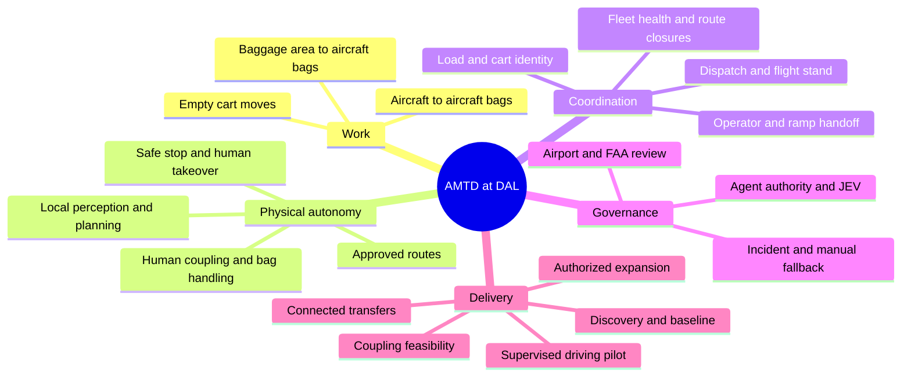
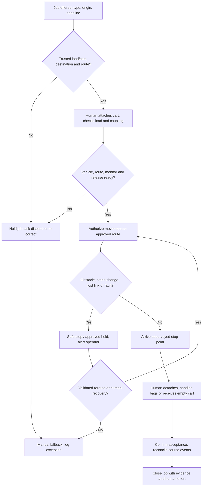
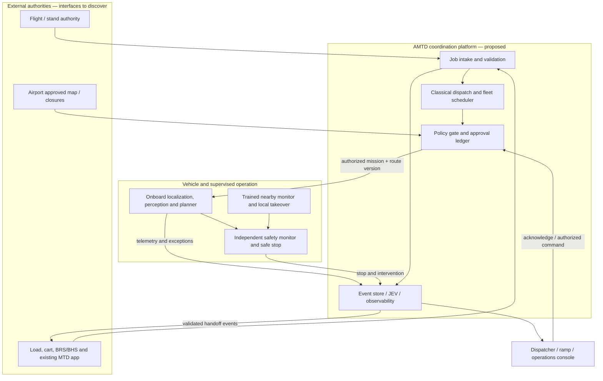
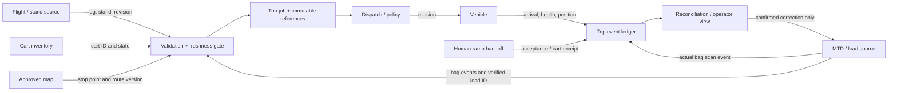
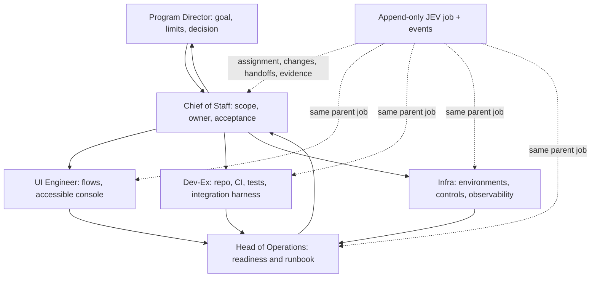
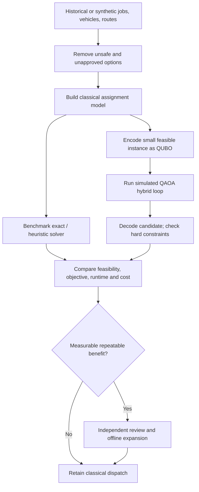

# Autonomous Mobile Transfer Driver — visual design pack

**Version:** concept 0.1 · 18 September 2026 · **Status:** design proposal for DAL discovery, not an approved airport operating procedure

**Read with:** *Autonomous Mobile Transfer Driver Project Brief (1).md* and *Project Description .docx*. Rugil Airlines is an example. The actual airline, handler, vehicle supplier, airport route, interfaces and quantitative service targets remain unconfirmed.

## 1. Project mind map

## 2. Operational flow — supervised pilot

For a bag trip, `vehicle_arrived`, `load_presented`, `load_accepted`, and `bags_loaded` are separate facts. Arrival never implies baggage loading. Empty-cart jobs require cart receipt, without invented bag events.

## 3. Logical architecture and safety boundary

**Safety rule:** A remote optimizer or agent may propose a mission, but only the policy gate can release an eligible mission. The vehicle must retain local stopping capability when disconnected. Onboard controls and the monitor implement the approved safety case; JEV is an audit record, not a vehicle brake. The exact safety architecture, latency budgets and separation require supplier and airport engineering review.

## 4. Data flow and ownership

| Fact | Proposed authoritative owner | Required distinction |
| --- | --- | --- |
| Flight leg and stand | Airline/airport flight or resource system, to identify | Stand name must resolve to an approved physical stop point. |
| Bag loading/unloading | Existing MTD app or baggage source, to verify | Preserve source semantics; do not synthesize a scan. |
| Load/cart identification | Handler inventory or BRS/BHS source, to identify | Block mismatched or absent IDs. |
| Vehicle position and health | Vehicle supplier interface | Position is evidence of motion, not custody. |
| Physical receipt | Named ramp/receiving actor | Record actor, time, cart/load and outcome. |
| Agent execution actions | JEV ledger | Link planning and implementation jobs to operational evidence, without treating JEV as the baggage system of record. |

Suggested trip event envelope: `event_id`, `job_id`, `trip_type`, `event_type`, `occurred_at`, `recorded_at`, `source_system`, `actor_id`, `vehicle_id`, `cart_id`, `load_id?`, `origin_flight_leg?`, `destination_flight_leg?`, `location_id`, `route_version?`, `correlation_id`, `supersedes_event_id?`, `evidence_ref`. Agree privacy, retention, idempotency and correction rules with source owners.

## 5. Agent delivery and JEV workflow

Each contribution cites a parent job, accountable owner, authority limit, action, reason, result, evidence, and receiving owner. Agents may research, draft and test within authorization. Changes to scope, spending, safety policy, access policy and live service require the Program Director's applicable decision; operational incident actions follow an approved runbook. Physical dispatch is governed separately by the airport/handler operating authority.

## 6. Design references and transfer of ideas

| Reference | Pattern considered for AMTD | Boundary |
| --- | --- | --- |
| Tesla autonomy | Onboard perception and planning as an architectural inspiration; supervisor visibility and intervention as a design concern. | Do not claim Tesla software, vehicles or models are airport certified, licensed or selected. Airport ground vehicle perception must be validated for its own operating conditions. |
| Amazon sortation | Identify items at induction, track each movement, route to a designated destination, reconcile exceptions; coordinate multiple mobile robots. | An airport ramp is not a controlled warehouse. Bag scans and custody remain in airline/handler systems. Do not infer an Amazon partnership or reuse proprietary technology. |
| Classical optimization | Assign eligible jobs to vehicles against deadlines, approved route times, capacity, battery and monitoring constraints. | A safety veto always overrides schedule value. This is the live baseline. |
| Quantum research | Compare a small batch assignment QUBO/QAOA experiment with a classical solver on historical or synthetic cases. | No quantum service on the vehicle control loop or live dispatch critical path; no presumed speed or quality advantage. |

The Amazon analogy is supported by its accounts of [robotic sortation and scanned package induction](https://www.aboutamazon.com/news/operations/new-robots-new-jobs), [six-sided scanning](https://www.aboutamazon.com/news/operations/new-amazon-robots-delivery-station), and [fleet coordination research](https://www.aboutamazon.com/news/operations/amazon-million-robots-ai-foundation-model). [IBM's QAOA tutorial](https://quantum.cloud.ibm.com/docs/en/tutorials/quantum-approximate-optimization-algorithm) describes the hybrid experimental method. Tesla is a conceptual reference only; no Tesla product specification was used to assert airport suitability.

## 7. Quantum algorithm research workflow

Example decision variable: `x[j,v] = 1` when eligible vehicle `v` takes job `j`. Minimize weighted lateness, travel and empty movement, subject to one assignment per job, vehicle capacity, approved routes, charge reserve, time windows and required monitor availability. Hard safety exclusions are filtered *before* optimization and checked again afterward; do not rely on a penalty term to make an unsafe option acceptable. The QUBO experiment addresses a reduced assignment subproblem, not continuous vehicle control or reactive obstacle avoidance. Compare with the same data, constraints and deadline budget; publish failed or infeasible runs too.

## 8. Figma-ready screen concept

The accompanying **AMTD-Operator-Console-Concept.svg** is an editable vector wireframe that can be imported into Figma. It shows a single job, a verified destination, vehicle status, custody milestones, a safe-stop alert and operator actions. The labels and values are illustrative test data, not a live DAL route or flight.

### Open design decisions

1. Airport sponsor: surveyed permitted route, hold positions, operating conditions, current rules and approval path.
2. Handler/airline: existing MTD event semantics, load release and receiving acceptance; actual partner identity.
3. Supplier: vehicle sensor suite, safety controller, lost-link behavior, towing envelope and manual takeover.
4. Program Director: agent execution environment, permission limits and JEV evidence retention.
5. Operations: staffing, incident response, baseline timings and pilot acceptance thresholds.

**Source hierarchy:** the two supplied project files set the project scope. External examples inform patterns only. All system names not confirmed by a partner remain placeholders.
